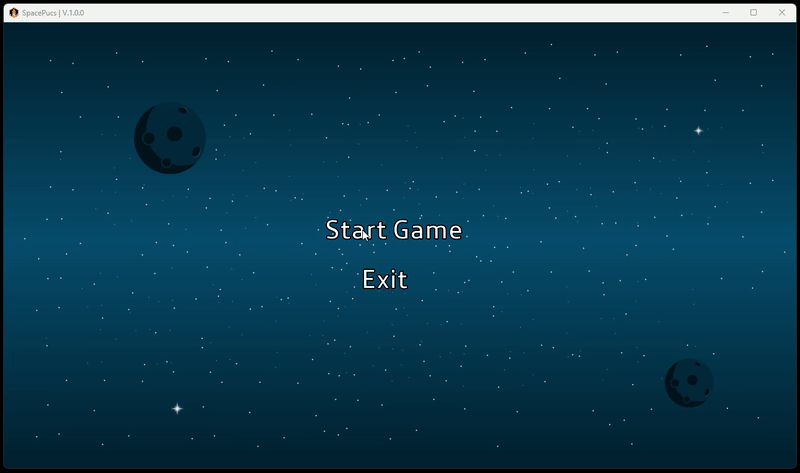

# 🚀 SpacePucs 🚀

Welcome to SpacePucs! This is my first game project and a significant milestone in my new journey as a developer. After changing careers and diving headfirst into a Java bootcamp, I created this game as my first "big step" into the world of programming. It's simple, but full of learning and enthusiasm — I hope you enjoy it!

## About the Game 🎮

SpacePucs is a straightforward game, but made with a lot of excitement and learning. Face obstacles, navigate through space, and try to beat your high score (or just survive)!

## How to Play 🕹️ 

Download the game: Download the .jar file.
Run it: Open the terminal, navigate to the download folder, and run: java -jar SpacePucs.jar.
Note: Your java version should be 17.0 ou higher.

## Instructions 🕹️

Use the arrow keys to move your spaceship and press the spacebar to shoot fireballs at your enemies! If you die, you can press Enter and play again.
And that’s it! Enjoy the intergalactic adventure!

## Next Steps 🚀 

This is just the beginning, but I already have plenty of ideas for the future. Follow along and feel free to give suggestions!

## Demo 🎮

Have fun! 🎉

